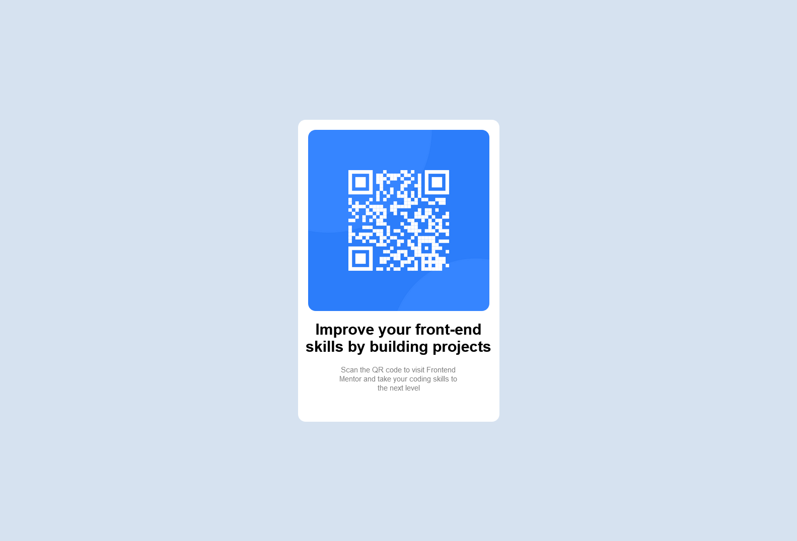

# Frontend Mentor - QR code component solution

This is a solution to the [QR code component challenge on Frontend Mentor](https://www.frontendmentor.io/challenges/qr-code-component-iux_sIO_H). Frontend Mentor challenges help you improve your coding skills by building realistic projects. 

## Table of contents

- [Overview](#overview)
  - [Screenshot](#screenshot)
  - [Links](#links)
- [My process](#my-process)
  - [Built with](#built-with)
  - [Useful resources](#useful-resources)
- [Author](#author)

## Overview

### Screenshot

### Links

- Solution URL: [Add solution URL here](https://github.com/MadivaLenny/qr-code-component)
- Live Site URL: [Add live site URL here](https://madivalenny.github.io/qr-code-component/)

## My process

### Built with

- Semantic HTML5 markup
- CSS custom properties
- Flexbox

### Useful resources

- (https://www.w3schools.com/css/css_padding.asp) - This helped me for better understanding about padding and margins. I really liked this pattern and will use it going forward.
- (https://www.w3schools.com/css/css3_images.asp) - This is an amazing article which helped me finally understand how to style images. I'd recommend it to anyone still learning this concept.

## Author

- Website - [Lenny Madiva](https://www.lennymadiva.com)
- Frontend Mentor - [@ymadivalenny](https://www.frontendmentor.io/profile/MadivaLenny)
- Twitter - [@madiva_lenny](https://www.twitter.com/madiva_lenny)

